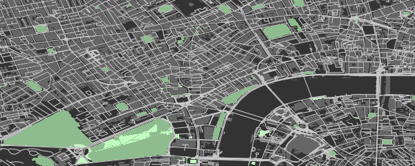
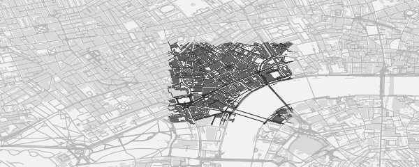
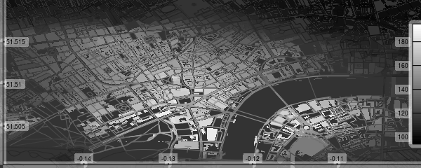

<!-- README.md is generated from README.Rmd. Please edit that file -->

[](https://travis-ci.org/ropensci/osmplotr)
[](https://ci.appveyor.com/project/ropensci/osmplotr)
[](https://codecov.io/gh/ropensci/osmplotr)
[](http://www.repostatus.org/#active)


[](http://cran.r-project.org/package=osmplotr)
[](http://cran.r-project.org/package=osmplotr)
[](https://github.com/ropensci/onboarding/issues/27)

R package to produce visually impressive customisable images of
OpenStreetMap (OSM) data downloaded internally from the [overpass
api](http://overpass-api.de/). The above map was produced directly from
`osmplotr` with no further modification. This `README` briefly
demonstrates the following functionality:

[1. Quick Introduction](#1%20intro)

[2. Installation](#2%20installation)

[3. A Simple Map](#3%20simple%20map)

[4. Highlighting Selected Areas](#4%20highlighting%20areas)

[5. Highlighting Clusters](#5%20highlighting%20clusters)

[6. Highlighting Areas Bounded by Named
Highways](#6%20highlighting%20with%20highways)

[7. Data Surfaces](#7%20data%20surfaces)

[8. Gallery](#8%20gallery)

------------------------------------------------------------------------

<a name="1 intro"></a>1. Quick Introduction
-------------------------------------------

But first the easy steps to map making:

1.  Specify the bounding box for the desired region

    ``` r
    bbox <- get_bbox (c(-0.15, 51.5, -0.10, 51.52))
    ```

2.  Download the desired data—in this case, all building perimeters.

    ``` r
    dat_B <- extract_osm_objects (key = 'building', bbox = bbox)
    ```

3.  Initiate an `osm_basemap` with desired background (`bg`) colour

    ``` r
    map <- osm_basemap (bbox = bbox, bg = 'gray20')
    ```

4.  Overlay objects on plot in the desired colour.

    ``` r
    map <- add_osm_objects (map, dat_B, col = 'gray40')
    ```

5.  Print the map to graphics device of choice

    ``` r
    print_osm_map (map)
    ```

------------------------------------------------------------------------

<a name="2 installation"></a>2. Installation
--------------------------------------------

First install the package

``` r
install.packages ('osmplotr')
```

or the development version

``` r
devtools::install_github ('ropensci/osmplotr')
```

And then load it in the usual way

``` r
library (osmplotr)
```

------------------------------------------------------------------------

<a name="3 simple map"></a>3. A Simple Map
------------------------------------------

Simple maps can be made by overlaying different kinds of OSM data in
different colours:

``` r
dat_H <- extract_osm_objects (key = 'highway', bbox = bbox)
dat_P <- extract_osm_objects (key = 'park', bbox = bbox)
dat_G <- extract_osm_objects (key = 'landuse', value = 'grass', bbox = bbox)
```

``` r
map <- osm_basemap (bbox = bbox, bg = 'gray20')
map <- add_osm_objects (map, dat_B, col = 'gray40')
map <- add_osm_objects (map, dat_H, col = 'gray80')
map <- add_osm_objects (map, dat_P, col = 'darkseagreen')
map <- add_osm_objects (map, dat_G, col = 'darkseagreen1')
print_osm_map (map)
```

<!--

-->


------------------------------------------------------------------------

<a name="4 highlighting areas"></a>4. Highlighting Selected Areas
-----------------------------------------------------------------

`osmplotr` is primarily intended as a data visualisation tool,
particularly through enabling selected regions to be highlighted.
Regions can be defined according to simple point boundaries:

``` r
pts <- sp::SpatialPoints (cbind (c (-0.115, -0.13, -0.13, -0.115),
                             c (51.505, 51.505, 51.515, 51.515)))
```

OSM objects within the defined regions can then be highlighted with
different colour schemes. `cols` defines colours for each group (with
only one here), while `bg` defines the colour of the remaining,
background area.

``` r
map <- osm_basemap (bbox = bbox, bg = 'gray20')
map <- add_osm_groups (map, dat_B, groups = pts, cols = 'orange', bg = 'gray40')
map <- add_osm_objects (map, london$dat_P, col = 'darkseagreen1')
map <- add_osm_groups (map, london$dat_P, groups = pts, cols = 'darkseagreen1',
                   bg = 'darkseagreen', boundary = 0)
print_osm_map (map)
```

<!--

-->


Note the `border = 0` argument on the last call divides the park
polygons precisely along the border. The same map highlighted in
dark-on-light:

``` r
map <- osm_basemap (bbox = bbox, bg = 'gray95')
map <- add_osm_groups (map, dat_B, groups = pts, cols = 'gray40', bg = 'gray85')
map <- add_osm_groups (map, dat_H, groups = pts, cols = 'gray20', bg = 'gray70')
print_osm_map (map)
```

<!--

-->


------------------------------------------------------------------------

<a name="5 highlighting clusters"></a>5. Highlighting Clusters
--------------------------------------------------------------

`add_osm_groups` also enables plotting an entire region as a group of
spatially distinct clusters of defined colours. Groups can be defined by
simple spatial points denoting their centres:

``` r
set.seed (2)
ngroups <- 12
x <- bbox [1, 1] + runif (ngroups) * diff (bbox [1, ])
y <- bbox [2, 1] + runif (ngroups) * diff (bbox [2, ])
groups <- cbind (x, y)
groups <- apply (groups, 1, function (i)
              sp::SpatialPoints (matrix (i, nrow = 1, ncol = 2)))
```

Calling `add_osm_groups` with no `bg` argument forces all points lying
outside those defined groups to be allocated to the nearest groups, and
thus produces an inclusive grouping extending across an entire region.

``` r
map <- osm_basemap (bbox = bbox, bg = 'gray20')
map <- add_osm_groups (map, dat_B, groups = groups,
                       cols = rainbow (length (groups)), border_width = 2)
print_osm_map (map)
```

<!--

-->


------------------------------------------------------------------------

<a name="6 highlighting with highways"></a>6. Highlighting Areas Bounded by Named Highways
------------------------------------------------------------------------------------------

An alternative way of defining highlighted groups is by naming the
highways encircling desired regions.

``` r
# These highways extend beyond the previous, smaller bbox
bbox_big <- get_bbox (c(-0.15, 51.5, -0.10, 51.52))
highways <- c ('Davies.St', 'Berkeley.Sq', 'Berkeley.St', 'Piccadilly',
               'Regent.St', 'Oxford.St')
highways1 <- connect_highways (highways = highways, bbox = bbox_big)
highways <- c ('Regent.St', 'Oxford.St', 'Shaftesbury')
highways2 <- connect_highways (highways = highways, bbox = bbox_big)
highways <- c ('Piccadilly', 'Shaftesbury.Ave', 'Charing.Cross.R',
               'Saint.Martin', 'Trafalgar.Sq', 'Cockspur.St',
               'Pall.Mall', 'St.James')
highways3 <- connect_highways (highways = highways, bbox = bbox_big)
highways <- c ('Charing.Cross', 'Duncannon.St', 'Strand', 'Aldwych',
               'Kingsway', 'High.Holborn', 'Shaftesbury.Ave')
highways4 <- connect_highways (highways = highways, bbox = bbox_big)
highways <- c ('Kingsway', 'Holborn', 'Farringdon.St', 'Strand',
               'Fleet.St', 'Aldwych')
highways5 <- connect_highways (highways = highways, bbox = bbox_big)
groups <- list (highways1, highways2, highways3, highways4, highways5)
```

And then passing these lists of groups returned by `connect_highways` to
`add_osm_groups`, this time with some Wes Anderson flair.

``` r
map <- osm_basemap (bbox = bbox, bg = 'gray20')
library (wesanderson)
cols <- wes_palette ('Darjeeling', 5)
map <- add_osm_groups (map, dat_B, groups = groups, boundary = 1,
                       cols = cols, bg = 'gray40', colmat = FALSE)
map <- add_osm_groups (map, dat_H, groups = groups, boundary = 0,
                       cols = cols, bg = 'gray70', colmat = FALSE)
print_osm_map (map)
```

<!--

-->


------------------------------------------------------------------------

<a name="7 data surfaces"></a>7. Data Surfaces
----------------------------------------------

Finally, `osmplotr` contains a function `add_osm_surface` that spatially
interpolates a given set of spatial data points and colours OSM objects
according to a specified colour gradient. This is illustrated here with
the `volcano` data projected onto the `bbox`.

``` r
x <- seq (bbox [1, 1], bbox [1, 2], length.out = dim (volcano)[1])
y <- seq (bbox [2, 1], bbox [2, 2], length.out = dim (volcano)[2])
xy <- cbind (rep (x, dim (volcano) [2]), rep (y, each = dim (volcano) [1]))
z <- as.numeric (volcano)
dat <- data.frame (x = xy [, 1], y = xy [, 2], z = z)
```

``` r
map <- osm_basemap (bbox = bbox, bg = 'gray20')
cols <- gray (0:50 / 50)
map <- add_osm_surface (map, dat_B, dat = dat, cols = cols)
# Darken cols by ~20%
map <- add_osm_surface (map, dat_H, dat = dat,
                        cols = adjust_colours (cols, -0.2))
map <- add_colourbar (map, cols = cols, zlims = range (volcano))
map <- add_axes (map)
print_osm_map (map)
```

<!--

-->


------------------------------------------------------------------------

<a name="8 gallery"></a>8. Gallery
----------------------------------

Got a nice `osmplotr` map? Please contribute in one of the following
ways:

1.  Fork repo, add link to `README.md/.Rmd`, and send pull request; or

2.  Open issue with details; or

3.  Send email to address in
    [`DESCRIPTION`](https://github.com/ropensci/osmplotr/blob/master/DESCRIPTION).

------------------------------------------------------------------------

See package vignettes ([basic
maps](https://docs.ropensci.org/osmplotr/articles/basic-maps.html) and
[data
maps](https://docs.ropensci.org/osmplotr/articles/data-maps.html)) for
a lot more detail and further capabilities of `osmplotr`. Please note
that this project is released with a [Contributor Code of
Conduct](CODE_OF_CONDUCT.md). By participating in this project you agree
to abide by its terms.

------------------------------------------------------------------------

[](http://ropensci.org)
